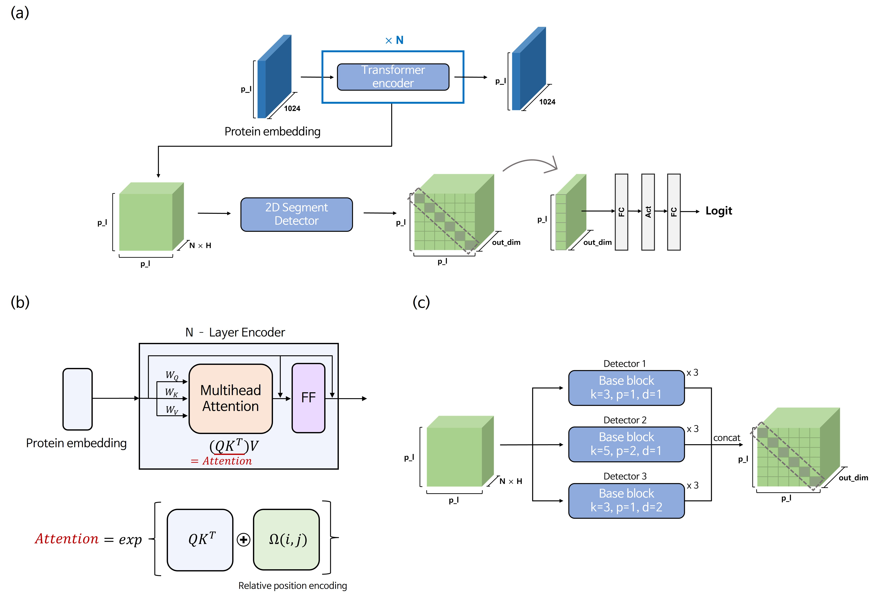

# **Protein Secondary Structure Prediction by capturing local patterns from attention map**




(a) Whole Architecture
(b) Transformer encoder layer
(c) 2D Segment Detector

## **Environment**
  
GeForce RTX 3090
- python == 3.8.12
- pytorch == 1.9.0
- cudatoolkit == 11.1.1
- argparse


## **Evaluation**
- For model trained with NetsurfP-2.0 DSSP8 dataset
```

python evaluation.py --train_data_type Netsurf --str_type dssp8 --model MASKSecondary_Netsurf_dssp8_T5_emb_dropout_0.3_16_RPE_seg_feature_block3.jit.pt

```

- For model trained with Proteinnet DSSP8 dataset
```

python evaluation.py --train_data_type Proteinnet --str_type dssp8 --model MASKSecondary_Proteinnet_dssp8_T5_emb_dropout_0.3_16_RPE_seg_feature_block3.jit.pt

```

- For model trained with NetsurfP-2.0 DSSP3 dataset
```

python evaluation.py --train_data_type Netsurf --str_type dssp3 --model MASKSecondary_Netsurf_dssp3_T5_emb_dropout_0.3_16_RPE_seg_feature_block3.jit.pt

```

- For model trained with Proteinnet DSSP3 dataset
```

python evaluation.py --train_data_type Proteinnet --str_type dssp3 --model MASKSecondary_Proteinnet_dssp3_T5_emb_dropout_0.3_16_RPE_seg_feature_block3.jit.pt

```
